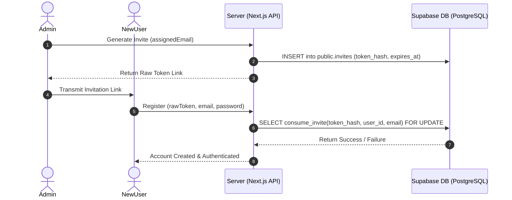

# 01_PRD.md — Product Requirements Document

This Product Requirements Document (PRD) documents the feature set, user flows, and implementation status of the **Private Chat** application as derived from the codebase.

---

## 1. Product Overview & Problem Statement

Private Chat is a secure, invite-only communication system designed for up to 50 users. It solves the privacy risk of public cloud messaging by implementing mandatory client-side End-to-End Encryption (E2EE) built on `@signalapp/libsignal-client`.

---

## 2. Target Users & Access Control

- **Target Audience:** Closed private communities, security-conscious small teams (max 50 users).
- **Access Model:** Strict invitation-only registration. Users cannot sign up without an unexpired, unconsumed invitation token matching their email.
- **Roles:**
  - **Administrator:** Can generate and revoke invites, view all user profiles, and manage system settings.
  - **Member:** Can engage in 1-to-1 chats, join group chats, manage their own keys/devices, and adjust profile settings.

---

## 3. Implementation Status Matrix

| Feature Module | Sub-Feature | Implementation Status | Implementation Location / Notes |
|---|---|---|---|
| **Authentication** | Registration via Invite | **IMPLEMENTED** | [`database/functions/atomic_invite_consumption.sql`](file:///d:/social/database/functions/atomic_invite_consumption.sql), [`lib/invites/`](file:///d:/social/lib/invites) |
| **Authentication** | Supabase Auth (Email/Password) | **PARTIALLY IMPLEMENTED** | Shell pages in [`app/(auth)/`](file:///d:/social/app/(auth)), needs production Supabase wireup |
| **1-to-1 Messaging** | E2EE Signal Handshake & Double Ratchet | **IMPLEMENTED** | [`crypto/messages/messageEncryptor.ts`](file:///d:/social/crypto/messages/messageEncryptor.ts), tested in [`tests/crypto/e2ee.test.ts`](file:///d:/social/tests/crypto/e2ee.test.ts) |
| **Group Messaging** | E2EE Sender Keys Distribution & Rotation | **IMPLEMENTED** | [`crypto/groups/groupEncryptor.ts`](file:///d:/social/crypto/groups/groupEncryptor.ts) |
| **Media Attachments** | Client AES-256-GCM Encrypted Files | **IMPLEMENTED** | [`crypto/attachments/attachmentEncryptor.ts`](file:///d:/social/crypto/attachments/attachmentEncryptor.ts) |
| **Key Management** | Key Store Export & Argon2id Backup | **IMPLEMENTED** | [`crypto/backup/keyBackup.ts`](file:///d:/social/crypto/backup/keyBackup.ts) |
| **User Directory** | Presence & Public Device Key Discovery | **IMPLEMENTED** | [`database/migrations/003_security_foundation.sql`](file:///d:/social/database/migrations/003_security_foundation.sql) |
| **Realtime Sync** | Supabase Realtime WebSocket Sync | **PLANNED** | Schema ready in DB; UI prototype currently relies on local mock state |
| **API Integration** | Production Next.js Route Handlers | **PARTIALLY IMPLEMENTED** | Placeholders in [`app/api/`](file:///d:/social/app/api) returning `{}` |

---

## 4. Detailed User Flows

### 4.1 Authentication & Invite Consumption Flow

### 4.2 1-to-1 E2EE Messaging Flow
1. **Prekey Retrieval:** Alice fetches Bob's public prekey bundle from `public.user_devices`.
2. **Session Initialization:** Alice builds a Signal outbound session using `@signalapp/libsignal-client` and stores the session record in IndexedDB (`SignalKeyStore`).
3. **Message Encryption:** Alice encrypts the message plaintext. The resulting payload contains base64 `ciphertext` and `nonce`.
4. **Storage:** Alice sends the encrypted payload to Supabase `public.messages`.
5. **Decryption:** Bob reads `public.messages`, inspects `nonce`, deserializes the Signal message, and decrypts it using his local session key.

### 4.3 Group E2EE Messaging Flow
1. **Group Key Generation:** Sender creates a Signal `SenderKeyDistributionMessage`.
2. **Key Envelope Distribution:** Sender encrypts the group sender key using 1-to-1 E2EE for each member's device and inserts rows into `public.group_key_envelopes`.
3. **Group Message Broadcast:** Sender encrypts the message with `groupEncrypt` and posts to `public.messages`.
4. **Group Decryption:** Recipients process their key envelope to establish sender keys, then execute `groupDecrypt`.
