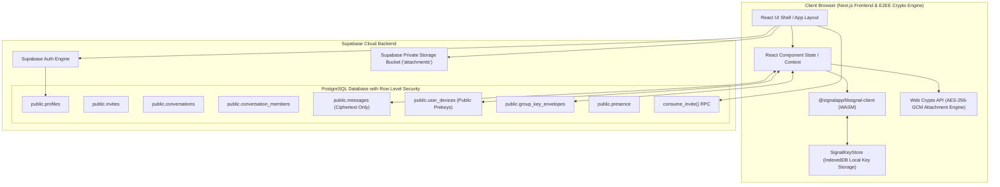
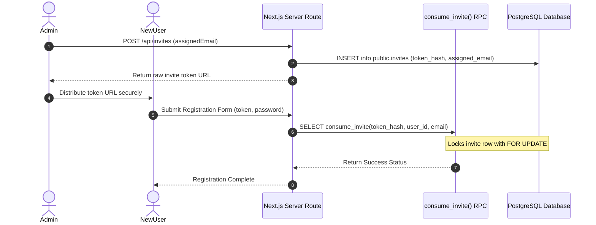
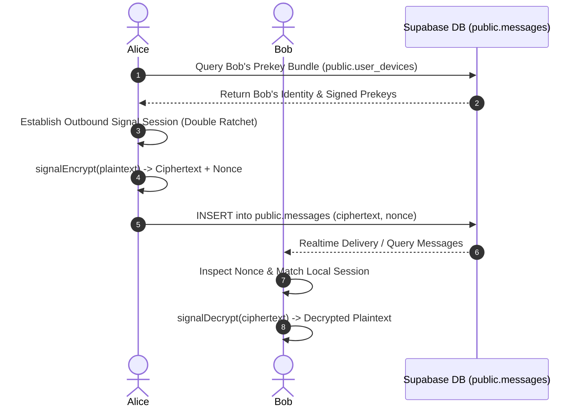
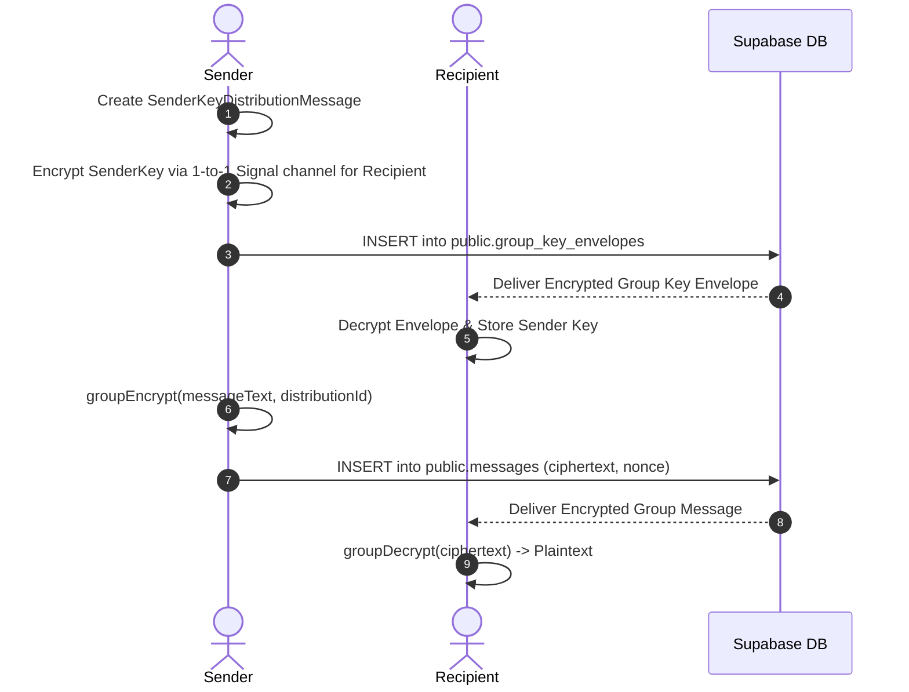
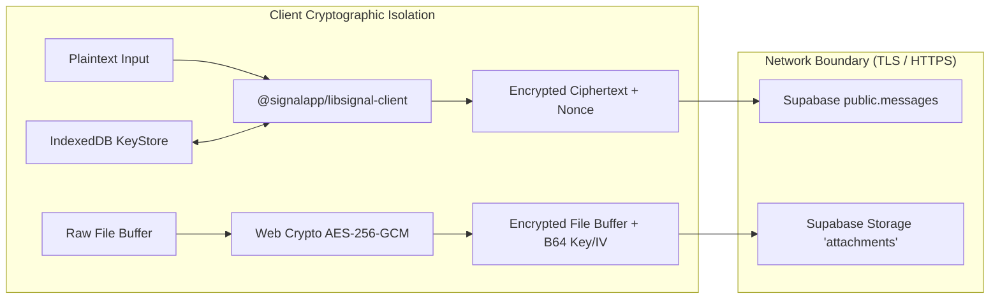
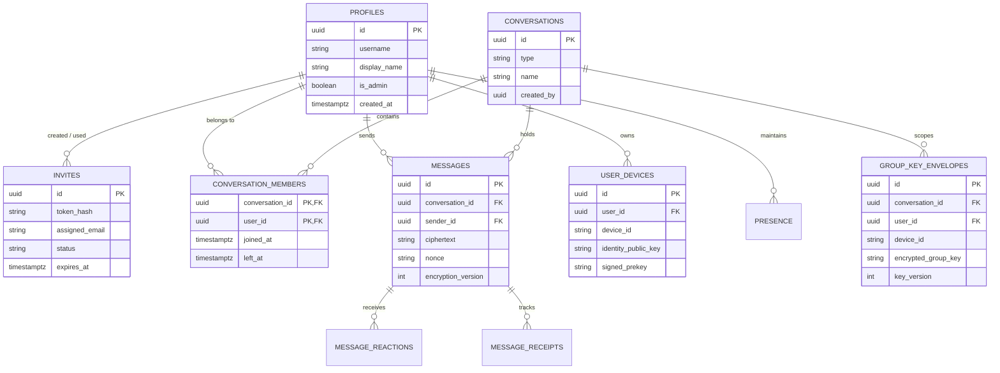
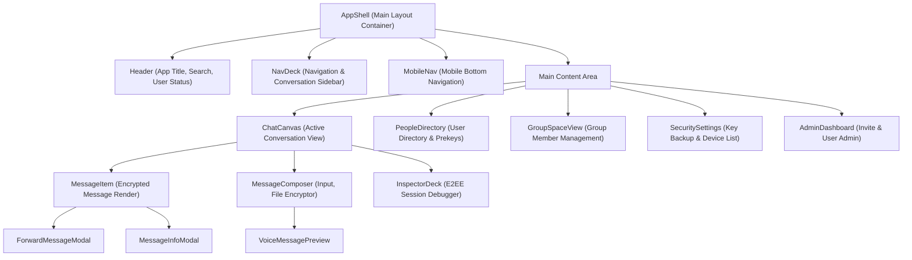

# 03_ARCHITECTURE.md — System Architecture & Diagrams

This document details the high-level system architecture, client/server boundaries, module responsibilities, and key system workflows of the **Private Chat** application.

---

## 1. High-Level System Architecture

---

## 2. Authentication & Invite Sequence Diagram

---

## 3. 1-to-1 Encrypted Message Flow

---

## 4. Group Encrypted Message Flow

---

## 5. End-to-End Encryption & Data Flow

---

## 6. Entity Relationship Diagram (Database Schema)

---

## 7. Main Frontend Component Structure

