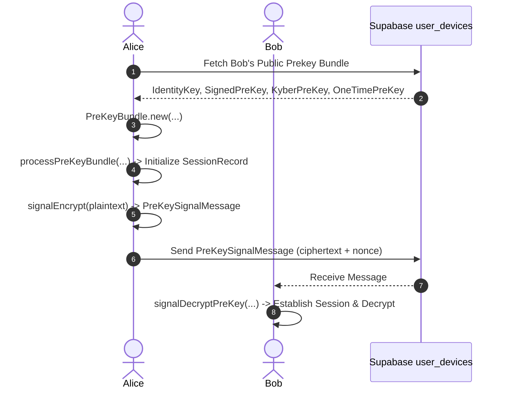
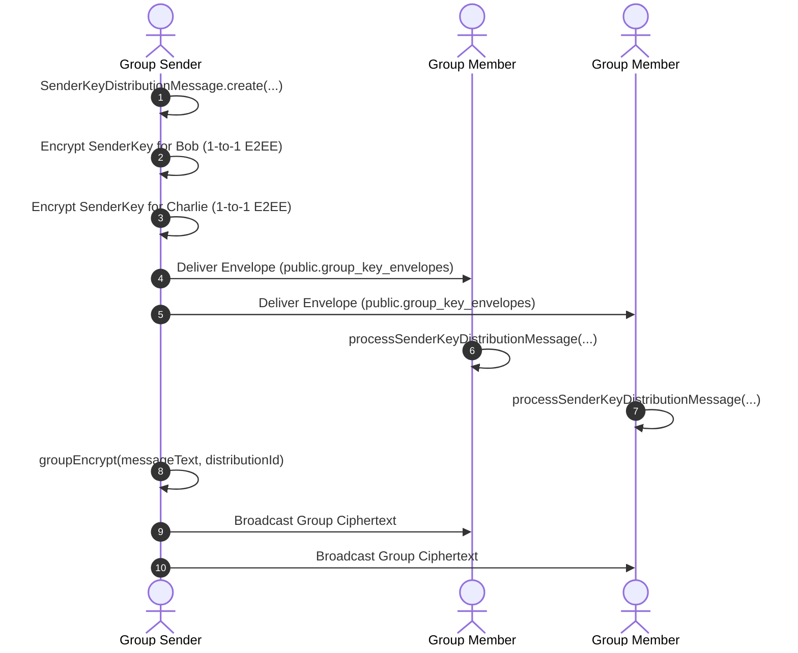

# 20_E2EE_SPEC.md — End-to-End Encryption Specification

This document presents the detailed technical specification of the client-side encryption system in **Private Chat**, built upon `@signalapp/libsignal-client`.

---

## 1. Cryptographic Components & Key Hierarchy

1. **Identity Key Pair (`IdentityKeyPair`):** Ed25519 long-term identity key pair generated on device setup ([`crypto/identity/deviceKeys.ts`](file:///d:/social/crypto/identity/deviceKeys.ts)).
2. **Signed PreKey (`SignedPreKeyRecord`):** Medium-term Curve25519 prekey signed by identity private key.
3. **One-Time PreKeys (`PreKeyRecord`):** Pool of single-use Curve25519 prekeys (5 generated initially).
4. **Post-Quantum Kyber PreKeys (`KyberPreKeyRecord`):** Quantum-resistant KEM key pairs (`KEMKeyPair`) signed by identity private key.
5. **Session State (`SessionRecord`):** Double Ratchet session state managing DH ratchets and symmetric chain keys.
6. **Group Keys (`SenderKeyRecord`):** Signal SenderKeys for efficient 1-to-N group message encryption.

---

## 2. Key Workflows & Diagrams

### 2.1 1-to-1 Session Establishment Flow

### 2.2 Group SenderKey Rotation Sequence

---

## 3. Media & File Attachment Encryption

Attachments are encrypted client-side using **AES-256-GCM** before network transmission ([`crypto/attachments/attachmentEncryptor.ts`](file:///d:/social/crypto/attachments/attachmentEncryptor.ts)):
1. Generate random 256-bit symmetric key (`attachmentKeyBytes`) and 96-bit IV (`ivBytes`) via Web Crypto API (`crypto.getRandomValues`).
2. Encrypt raw file Uint8Array buffer via `crypto.subtle.encrypt({ name: 'AES-GCM', iv }, cryptoKey, fileData)`.
3. Base64-encoded `attachmentKey` and `iv` travel **inside the E2EE message payload**.
4. Storage bucket receives only ciphertext bytes. The server cannot decrypt attachments.

---

## 4. Key Backup & Argon2id Derivation

- Passphrase-based key backup uses **Argon2id** (`hash-wasm`) for key derivation:
  - **Memory Cost:** 65,536 KB (64 MB).
  - **Time Cost / Iterations:** 3.
  - **Parallelism:** 4 threads.
  - **Hash Length:** 32 bytes (256 bits).
- Exported JSON state ([`crypto/storage/keyStorage.ts`](file:///d:/social/crypto/storage/keyStorage.ts#L153)) is encrypted using AES-256-GCM with a 128-bit random salt and 96-bit nonce.
