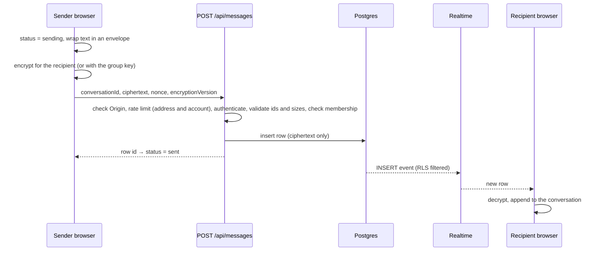
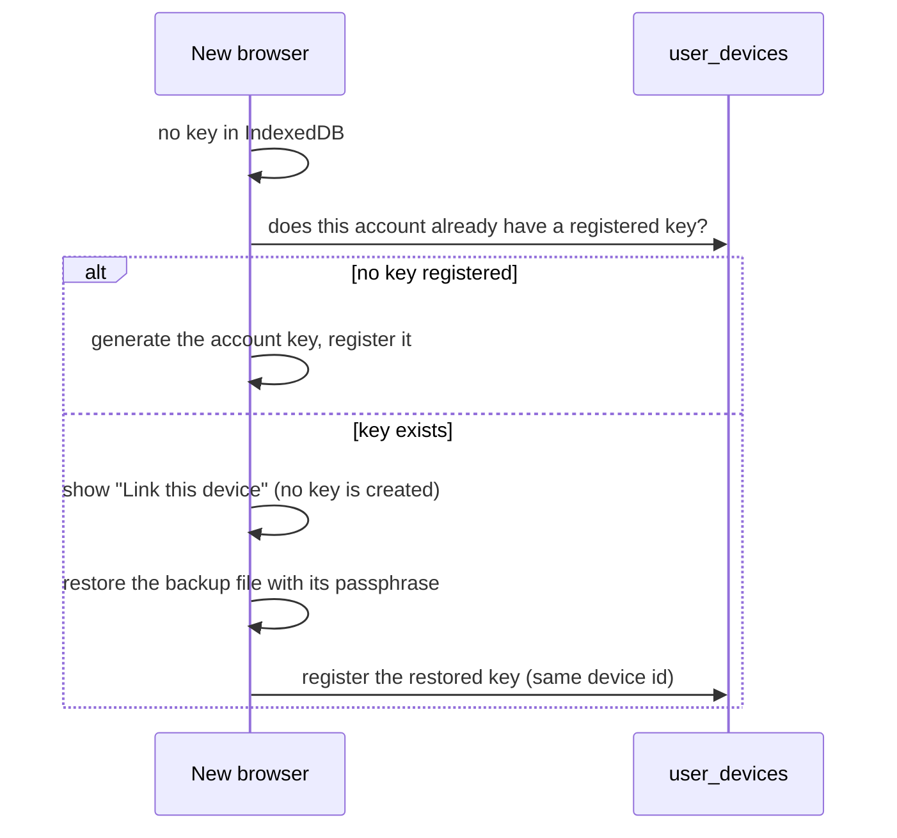

# Architecture

## Overview

```
┌─────────────────────────── Browser ───────────────────────────┐
│  React UI (components/)                                        │
│      │ subscribes                                              │
│  ChatStore (lib/store/chatStore.ts)  ←  useChatStore hook      │
│      │                                                         │
│  MessagingCrypto (lib/messaging/)  →  crypto/ (libsodium)      │
│      │                                  │                      │
│      │                            IndexedDB: private key       │
└──────┼─────────────────────────────────────────────────────────┘
       │ HTTPS: Supabase client (RLS)          Realtime websocket
       ▼                                              ▲
┌─── Next.js server ────┐                             │
│ middleware.ts         │      ┌──────────────── Supabase ────────────────┐
│ app/api/* handlers    ├─────►│ Postgres + RLS · Auth · Storage · Realtime│
│ app/auth/confirm      │      └──────────────────────────────────────────┘
└───────────────────────┘
```

- **The browser does the cryptography.** Keys never leave it. The server and database only handle ciphertext plus the metadata needed to route it.
- **Supabase is the source of truth.** Conversations, messages, memberships and files all live there. The browser keeps a working copy in the store and a few view preferences in `localStorage`.
- **Two ways to reach the database**: through the Next.js API routes (which add rate limiting and explicit membership checks) and directly through the Supabase client from the browser for some reads and writes (reactions, storage downloads, realtime). Row level security protects both.
- **Middleware** first applies a flood limit (before any Supabase call), then refreshes the session on each request, protects routes and sets security headers. `next.config.ts` adds the Content-Security-Policy and the other response headers.

## Modules

| Path | Responsibility |
|---|---|
| `app/page.tsx` | The single-page app. Boots the session, creates the store and crypto session, opens the Realtime channel, renders the landing page, login, the **Link this device** screen (`components/auth/LinkDevice.tsx`, shown when this browser has no key but the account does), or the chat shell |
| `app/api/*` | Route handlers ([API reference](API.md)) |
| `app/auth/confirm/route.ts` | Landing point for email confirmation, password reset and Google sign-in redirects |
| `app/(auth)/*` | `/login`, `/signup`, `/register`, `/forgot-password`, `/reset-password`, `/verify-email` (`/invite` just redirects to `/signup`), all rendering the same auth components |
| `app/(chat)/*`, `app/admin/*` | Thin routes that redirect into the single-page app |
| `components/` | UI, grouped by area (see below) |
| `lib/store/chatStore.ts` | All client state and actions (~1,300 lines). Real mode and demo mode |
| `lib/messaging/` | `messagingCrypto.ts` (session-scoped crypto orchestration), `envelope.ts` (message payload types), `envelopeDisplay.ts` (payload to UI text), `messageService.ts` (fetch and send), `attachments.ts` (encrypted upload and download) |
| `crypto/` | Cryptographic primitives ([E2EE](E2EE.md)) |
| `lib/supabase/` | Browser, server and admin clients, env helpers, middleware session refresh |
| `lib/auth/roles.ts` | Server-side admin check against `profiles.is_admin` |
| `lib/api/security.ts` | Helpers every API route uses: UUID and date validation, trusted client address, per-address and per-account limits, cross-site (Origin) check, bounded JSON reader, generic server errors, file-name sanitiser |
| `lib/rate-limit/rateLimiter.ts` | The rate limiter (Upstash Redis, or in memory per server instance) |
| `lib/ui/errors.ts` | Decides who sees how much of an error: everyone gets a friendly message, platform admins also get the technical detail |
| `lib/ui/theme.ts`, `lib/ui/themeScript.ts` | Theme preference. Default is `system` (follows the device); an inline script sets `data-theme` before first paint so there is no flash |
| `lib/calls/`, `lib/realtime/` | WebRTC calls and the presence and typing channels (typing and call channels are private, see [Database](DATABASE.md#realtime)) |
| `database/` | Migrations, the source of truth for the schema ([Database](DATABASE.md)) |
| `types/database.ts` | Typed mirror of the schema; update it with every migration |

### Components by area

`layout/` (AppShell, NavDeck, MobileNav) · `chat/` (ChatCanvas, InspectorDeck) · `messages/` (MessageItem, MessageComposer, ...) · `people/` · `groups/` · `community/` · `settings/` (one file per section) · `admin/` · `auth/` (LoginForm, AuthLayout, LinkDevice, ...) · `onboarding/` · `landing/` (the 3D landing page, see [Design](DESIGN.md)) · `calls/` · `notifications/` · `privacy/` · `saved/` · `search/` · `profile/` · `ui/` (Button, Dialog, Input, Avatar, ...).

## State management

`ChatStore` is a plain class with a subscribe/notify contract, wrapped by `hooks/useChatStore.ts` using React's `useSyncExternalStore`. Two rules keep it correct:

- `notify()` replaces the top-level state object before calling listeners. React only re-renders when the snapshot reference changes; without this, methods that mutate `this.state.field` would update data but never redraw the screen.
- Anything that arrives for the same message twice (a realtime insert after your own send) is de-duplicated by id.

**Modes**
- `connected`: Supabase is configured. Conversations and history are fetched from the database.
- `demo`: development only. Seeded example data with cross-tab sync through `BroadcastChannel`. Selected in `app/page.tsx` when Supabase is not configured *and* `isDemoModeAllowed()` (non-production). In a production build a missing configuration is an error.

## Flows

### Sending a message



If the request fails, the message is marked `failed` and a retry button is shown. It is never shown as delivered on failure.

In groups the `nonce` column holds JSON: `{"nonce": ..., "keyVersion": ...}`.

### Receiving and live updates

`app/page.tsx` opens one Realtime channel with `postgres_changes` listeners on `messages` for `INSERT` (new messages) and `UPDATE` (edits and soft deletes), filtered to your conversation ids. Row level security is the real access control; the filter is an additional narrowing. Unknown conversations (for example you were just added to a group) trigger a conversation reload.

On conversation open, history comes from `GET /api/messages` (newest first, paged by `before`), is decrypted locally and displayed oldest first.

### Attachments and voice notes

1. The browser generates a random AES-256-GCM key and encrypts the file.
2. The ciphertext is uploaded through `POST /api/uploads` into the private `encrypted_attachments` bucket at `<conversationId>/<random uuid>_<safe name>`.
3. The storage path, key, IV, file name, type and size go **inside** the encrypted message envelope. The database never sees them.
4. Recipients download the ciphertext with the Supabase client (row level security on storage) and decrypt in the browser on demand.

### Group membership

Adding or removing a member re-fetches the current member list, generates a new group key version, and distributes it to each member device as a sealed box in `group_key_envelopes`. Removed members receive no new keys, and later members cannot read earlier history.

### Message payloads (envelopes)

Everything about a message is inside the encrypted payload: `{ v: 1, kind, ... }`.

| `kind` | Content |
|---|---|
| `text` | `text`, optional `mentions` |
| `attachment` | optional caption plus file descriptor |
| `voice` | file descriptor plus `durationMs` |
| `system` | notice text (group events) |
| `poll` / `poll_vote` | poll definition and votes (reserved for the polls feature) |
| `call` | call outcome record (reserved for calls) |

Unknown kinds from a newer app version render as "not supported" rather than failing. `poll_vote` envelopes are hidden from the message list.

## Routes

| Route | Purpose |
|---|---|
| `/` | The app: landing page when signed out, chat shell when signed in |
| `/login`, `/signup`, `/register` | Sign in and create account (the last two open the sign-up tab). `/invite` redirects to `/signup` so old links still work |
| `/forgot-password`, `/reset-password` | Password recovery |
| `/verify-email` | Static "check your inbox" page |
| `/auth/confirm` | Email link and Google callback handler |
| `/chat`, `/groups`, `/people`, `/settings/*`, `/admin/*` | Protected paths that lead into the app |
| `/privacy`, `/terms` | Static pages |

## Configuration and hardening

- `middleware.ts` rate limits by address, protects `/chat`, `/people`, `/groups`, `/settings` and `/admin`; admin access is verified against `profiles.is_admin`; missing Supabase configuration is a 500 in production.
- Response headers (`next.config.ts`, mirrored in `middleware.ts`): a Content-Security-Policy, HSTS, `X-Frame-Options: DENY`, `X-Content-Type-Options: nosniff`, `Referrer-Policy`, `Permissions-Policy` (camera and microphone for this site only), cross-origin isolation headers, and `Cache-Control: no-store` for `/api`.
- **Theme.** The app follows the device's light or dark setting unless the person picked one in Settings. Colours are CSS variables; `data-theme` on `<html>` is `system`, `dark` or `light`. The landing page's floating product cards are deliberately pinned to the dark palette.
- Layout: the chat shell is a fixed full-height container; other pages scroll normally.

## Linking a second device



All linked devices then hold the same key. Details and trade-offs are in [E2EE](E2EE.md#keys-and-linking-devices).
